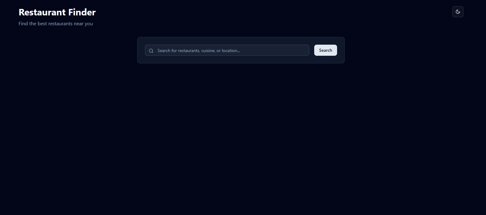
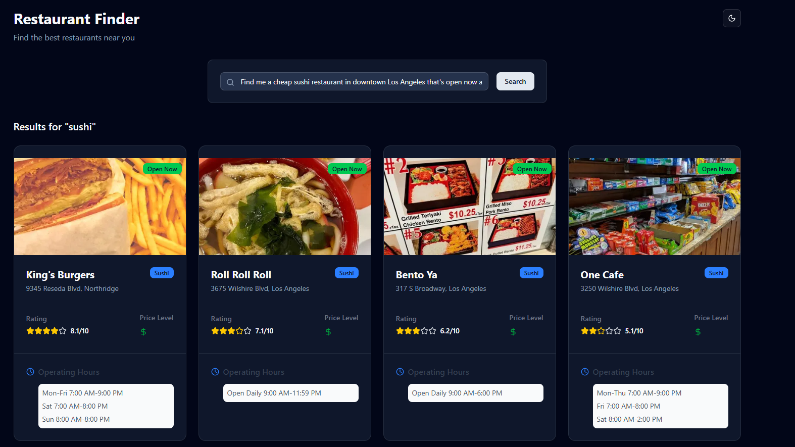

# 🍽️ LLM-Driven Restaurant Finder App

A smart, AI-powered restaurant search tool that lets users describe what they want in natural language—and returns personalized restaurant recommendations.

Powered by:

- **OpenRouter openai/gpt-4o-mini**
- **Foursquare Places API**

[🔗 Live Demo](https://restaurant-finder-nu.vercel.app/)

---

## 🚀 Features

- 🧠 Converts free-form user input into structured JSON using an LLM
- 🔍 Searches the Foursquare Places API based on structured search parameters
- 📍 Displays restaurant data including:
  - Name
  - Address
  - Rating
  - Price level
  - Operating hours

---

## 🔌 API Flow

The core logic happens in the following flow:

1. User submits a natural language query via the UI.
2. The query is sent to `POST /api/execute`
3. Backend does the following:
   - Sends the query to OpenRouter (GPT-4o-mini) with a structured prompt.
   - Receives a **strict JSON command**.
   - Uses the JSON parameters to query the **Foursquare Places API**.
   - Extracts key restaurant info and returns the data to the frontend.

```json
// Example Request Body:
{
  "message": "Find me a cheap sushi restaurant in downtown Los Angeles that's open now and has at least a 4-star rating."
}
```

---

## 🧠 Assumptions & Limitations

- The app currently supports **restaurant-only** queries (no hotels or other venue types).
- Cuisine detection relies on the LLM’s interpretation of the query and may not always perfectly match Foursquare’s categories.
- Operating hours and ratings are shown if available in Foursquare’s response; not all restaurants have complete data.

## 🛠️ Tech Stack

- **Frontend**: Next.js, TypeScript, Tailwind CSS
- **Backend**: Next.js, OpenRouter LLM, Foursquare Places API

---

## 📦 Getting Started

### 1. Clone the repo

```bash
git clone https://github.com/Creedyfish/restaurant_finder.git
```

Go to the project directory

```bash
  cd restaurant_finder
```

Install dependencies

```bash
npm install
# or
yarn install
```

### Create and acquire own environmental variables

`.env`

- FOURSQUARE_API_KEY=your_foursquare_api_key

- OPENROUTER_API_KEY=your_openrouter_api_key

Start the server

```bash
npm run dev
# or
yarn dev

```

Open http://localhost:3000 with your browser to see the result.

---

## Screenshots



